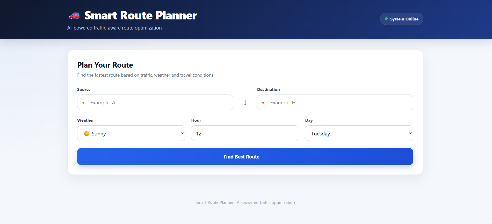
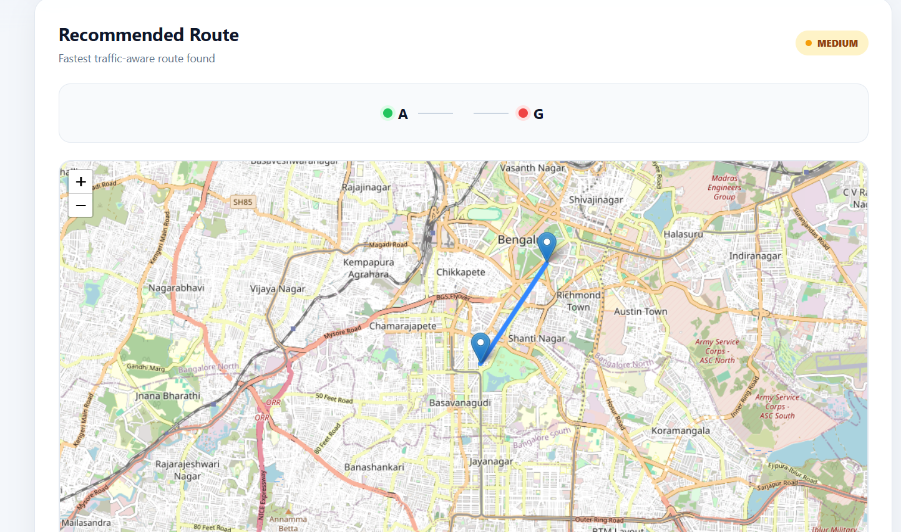
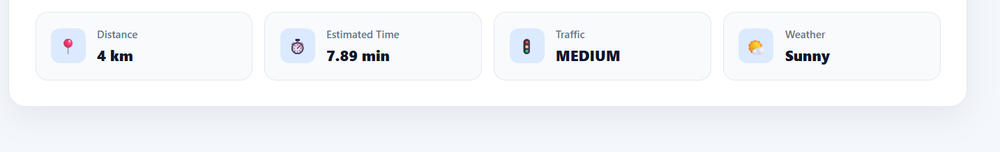

# 🚗 Smart Route Planner

An AI-powered traffic-aware route optimization system that finds efficient routes by combining **Machine Learning, graph algorithms, and real-time route conditions**.

Unlike traditional shortest-distance routing, Smart Route Planner predicts travel time for each road using **weather, time, day, road type, and base travel time**, then uses **Dijkstra's algorithm** to find the fastest traffic-aware route.

## 🚀 Live Demo

🌐 **Live Application:** https://smart-route-frontend.onrender.com

---

## ✨ Features

- 🚦 Traffic-aware route optimization
- 🧠 Random Forest-based travel-time prediction
- 🗺️ Interactive route visualization with Leaflet
- 📍 Source and destination selection
- 🌦️ Weather-aware prediction
- 🕐 Time and day-based traffic prediction
- 🛣️ Dijkstra shortest-path optimization
- 🔀 Alternative route generation and comparison
- 📊 Distance and estimated travel-time analytics
- 🚥 Low / Medium / High traffic classification
- 💾 MySQL database for locations and roads
- ⚡ FastAPI ML microservice
- 🌐 React + Spring Boot full-stack architecture
- 🛡️ Environment-based production configuration

---

## 🧠 How It Works

```text
User Input
   │
   ▼
React Frontend
   │
   ▼
Spring Boot Backend
   │
   ├──────────────► MySQL
   │
   ▼
Road Network
   │
   ▼
FastAPI ML Service
   │
   ▼
Random Forest Model
   │
   ▼
Predicted Travel Time
   │
   ▼
Traffic-Aware Graph
   │
   ▼
Dijkstra Algorithm
   │
   ▼
Recommended Route
   │
   ▼
Alternative Routes
   │
   ▼
React Dashboard + Map
```

### Traffic Prediction

The ML model predicts travel time using:

- Hour
- Day of week
- Weather
- Road type
- Base travel time

Categorical features are processed using **One-Hot Encoding**, and the trained model is stored using **Joblib**.

### Route Optimization

Each road becomes an edge in the graph, with predicted travel time used as the traffic-aware weight.

Dijkstra's algorithm then finds the route with the **lowest predicted travel time**, rather than simply choosing the shortest physical distance.

### Alternative Routes

The system also discovers and compares alternative routes using:

- Distance
- Predicted travel time
- Traffic level
- Route savings

---

## 🤖 Machine Learning

**Model:** Random Forest Regression

**Target:** `travel_time`

**Features:**

```text
hour
day_of_week
weather
road_type
base_travel_time
```

### Model Evaluation

| Metric | Result |
|---|---:|
| MAE | 1.50 minutes |
| R² Score | 0.9669 |

> The model is currently trained and evaluated on a synthetically generated dataset containing 5,000 records. These metrics demonstrate model performance on the project dataset and should not be interpreted as real-world traffic accuracy.

---

## 🛠️ Tech Stack

### Frontend
- React
- JavaScript
- Vite
- CSS
- React Leaflet

### Backend
- Java
- Spring Boot
- Spring Data JPA
- Hibernate
- REST APIs
- Maven

### Machine Learning
- Python
- FastAPI
- Pandas
- NumPy
- Scikit-learn
- Random Forest
- Joblib

### Database
- MySQL

### Algorithms
- Dijkstra's Shortest Path
- DFS-based Alternative Route Discovery
- Graph-based Route Optimization

### Tools
- Git & GitHub
- IntelliJ IDEA
- VS Code
- Postman

---

## 📸 Screenshots

### 🏠 Route Planning Interface



### 🗺️ Recommended Route & Interactive Map



### 📊 Route Details & Metrics



---

## 🔌 REST APIs

### Route API

```http
POST /api/routes
```

Example request:

```json
{
  "source": "A",
  "destination": "H",
  "weather": "Rain",
  "hour": 18,
  "dayOfWeek": 1
}
```

The response provides the recommended path, distance, estimated travel time, traffic level, weather, and route analytics.

### Location API

```http
GET /api/locations
```

### ML Service

```http
GET /
POST /predict
```

---

## 📁 Project Structure

```text
Smart-Route-Planner/
│
├── backend/
│   └── src/main/
│       ├── java/com/smartroute/backend/
│       │   ├── algorithm/
│       │   ├── controller/
│       │   ├── model/
│       │   ├── repository/
│       │   └── service/
│       └── resources/
│
├── frontend/
│   ├── src/
│   │   ├── components/
│   │   ├── App.jsx
│   │   └── index.css
│   ├── package.json
│   └── vite.config.js
│
├── ml-service/
│   ├── main.py
│   ├── train_model.py
│   ├── traffic_model.pkl
│   ├── traffic_data.csv
│   └── requirements.txt
│
├── screenshots/
│   ├── home.png
│   ├── recommended-route.png
│   └── route-details.png
│
├── .gitignore
├── requirements.txt
└── README.md
```

---

## 💻 Run Locally

### 1. Machine Learning Service

```bash
cd ml-service

python -m venv venv
```

Windows:

```powershell
.\venv\Scripts\Activate.ps1
```

Install dependencies:

```bash
pip install -r requirements.txt
```

Train the model:

```bash
python train_model.py
```

Start FastAPI:

```bash
uvicorn main:app --reload --port 8000
```

ML service:

```text
http://localhost:8000
```

### 2. Spring Boot Backend

Configure your MySQL database and environment variables, then run:

```text
BackendApplication
```

Backend:

```text
http://localhost:8080
```

### 3. React Frontend

```bash
cd frontend
npm install
npm run dev
```

Frontend:

```text
http://localhost:5173
```

---

## ☁️ Deployment

The production application uses a multi-service architecture:

```text
React Frontend
      │
      ▼
Render
      │
      ▼
Spring Boot Backend
      │
      ├──────► Aiven MySQL
      │
      ▼
FastAPI ML Service
```

Production configuration is handled through environment variables.

Sensitive credentials and database passwords should **never be committed to GitHub**.

---

## 🔐 Environment Variables

Typical production configuration:

```text
DB_URL
DB_USERNAME
DB_PASSWORD
ML_SERVICE_URL
```

Frontend:

```text
VITE_API_URL
```

Keep `.env` files and credentials out of version control.

---

## 🔮 Future Improvements

- Real-time traffic data
- Live weather API integration
- Real-world road network data
- Dynamic rerouting
- GPS-based current location
- Historical traffic datasets
- Accident and congestion detection
- Automated model retraining
- Mobile application
- Saved routes and route history
- CI/CD pipeline

---

## 🎯 What This Project Demonstrates

Smart Route Planner combines:

**Full-Stack Development + Machine Learning + Graph Algorithms + REST APIs + Database Management + Interactive Visualization**

to build an intelligent traffic-aware route optimization system.

---

## 👩‍💻 Author

**Muskan**

Computer Science & Engineering (AIML)

---

## 📄 License

This project is created for educational and portfolio purposes.